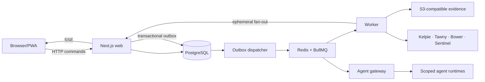

# Muster

> Muster is the shared workspace for human and agent-driven security operations.

Muster connects application telemetry, endpoint detections, security investigations and incident case management in one auditable workspace.

**Bring the signal together.**


Muster is a self-hosted workspace where analysts, responders, engineers, security products, and permission-scoped agents work in persistent security rooms. Signals, investigations, approvals, response actions, and linked cases arrive as channel activity instead of separate operational dashboards. Muster complements—not replaces—SIEM, EDR, SOAR, or formal case-management systems.

## What works

- Slack-familiar security rooms with channels, direct messages, threads, reactions, mentions, structured event cards, drafts, SSE updates, and responsive navigation
- Alert, investigation, approval, response, evidence, and linked-case activity rendered directly into durable room timelines
- Kelpie case, Tawny endpoint, and Bower telemetry-health adapters with explicit mock mode
- Versioned MSEP contracts, signed ingestion, replay protection, JSON Schema generation, and typed client primitives
- PostgreSQL-scoped domain services, transactional outbox, nine policy-separated BullMQ queues, idempotency, and hash-chained audit events
- Better Auth password, verification, TOTP, recovery-code, passkey, OIDC/Entra-ready configuration
- Capability-based authorisation and default approval policy for response actions
- Agent gateway trust boundaries, typed outputs, tool validation, cancellation, kill switch, cost limits, and governed continuous learning
- PWA shell with safe offline page and local draft preservation; sensitive data is not cached offline

## Quick start

Requirements: Docker Compose, or Node.js 24+, pnpm 11, PostgreSQL 17+, Redis 8+, and S3-compatible storage.

```bash
./scripts/bootstrap.sh
```

Or start everything directly:

```bash
docker compose up --build
```

Published releases are available from GitHub Container Registry:

```bash
docker pull ghcr.io/jusso-dev/muster:latest
```

The default CI workflow publishes `latest`, version tags, and immutable SHA tags with SBOM and provenance on pushes to `main`. Its final publication gate logs out of GHCR and verifies an anonymous pull, so CI fails if the package is not public.

For a single-node homelab installation that pulls the public image:

```bash
./scripts/install-homelab.sh
```

Open:

- Muster: http://localhost:3000
- Mailpit: http://localhost:8025
- MinIO console: http://localhost:9001

The bootstrap prints generated local credentials. All demo records are synthetic. Kelpie, Tawny, and Bower display a visible `Mock` state locally; mock success is never represented as production delivery.

## Architecture



PostgreSQL is authoritative. Redis holds execution and ephemeral fan-out state only. Kelpie remains authoritative for formal cases; Tawny for endpoint telemetry and bounded response; Bower for application telemetry selection and delivery evidence.

See [architecture](docs/architecture/README.md), [current upstream contracts](docs/integrations/current-upstream-contracts.md), and [threat model](docs/security/threat-model.md).

## Development

```bash
pnpm install
pnpm db:migrate
pnpm db:seed
pnpm dev
```

Quality gates:

```bash
pnpm lint
pnpm typecheck
pnpm test
pnpm build
pnpm test:e2e
pnpm screenshots
```

Public API contracts are under `/api/v1`; see [OpenAPI](docs/openapi.yaml). Generate MSEP JSON Schemas with `pnpm contracts:generate`.

## Security model

- Every domain record and query is organisation scoped.
- Routes, services, workers, integration tools, and agent tools enforce capabilities server-side.
- Dangerous state changes require an approval record; detection publication requires two approvers; evidence deletion is prohibited.
- Telemetry, files, URLs, documents, comments, and tool results enter prompts only as `untrusted_evidence`.
- Agent memories are evidence-backed. Skill proposals are immutable, evaluated, human-approved, versioned, and reversible; they cannot expand their own tools, permissions, data allowance, runtime, token, or cost limits.
- Evidence uses private object storage, short-lived access, hash verification, classification, quarantine, and audit metadata.

Read [SECURITY.md](SECURITY.md) before production use.

## Project status

This repository is an MVP reference implementation. External-product mocks are suitable only for local demonstration. Validate real connector versions, identity policies, retention, object lock, malware scanning, egress controls, backups, and high-availability design before production rollout.

## License

Apache-2.0. See [LICENSE](LICENSE).
