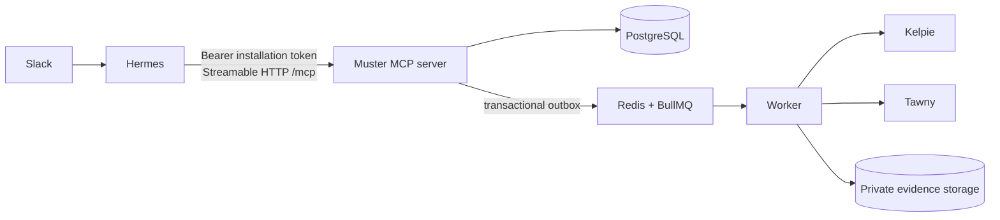

<p align="center">
  
</p>

<h1 align="center">Muster</h1>

> The governed control plane Hermes calls for security operations.

Muster is **not** a chat UI, PWA, or case-management product. Hermes owns
sessions, models, memory, delegation, and Slack delivery. Muster is the
authenticated, organisation-scoped control plane Hermes reaches over
[remote MCP](https://modelcontextprotocol.io) (Streamable HTTP). PostgreSQL is
the authoritative record; Redis and BullMQ are execution infrastructure only.

Muster does not replace a SIEM, EDR, SOAR, or case system. It stores
installation credentials, approvals, audit, missions, operational knowledge,
and governed connector runs around upstream products.

## Where Muster fits

Adjacent products stay authoritative for their own domains:

- [Kelpie](https://github.com/jusso-dev/Kelpie) — formal incident cases and
  case lifecycle. Muster proposes and records governed case work; Kelpie
  remains system of record.
- [Tawny](https://github.com/jusso-dev/tawny) — endpoint telemetry, detections,
  bounded hunts, and approved response. Muster holds request, approval,
  delivery, and evidence references around that work.
- [Bower](https://github.com/jusso-dev/bower) — application and legacy
  telemetry delivery health. Signals may be linked operationally; Bower is
  not a fully certified production connector in this tree.

Product direction and process boundaries are recorded in
[ADR 0005](docs/architecture/0005-remote-mcp-server.md).

## Operating model



- **Hermes** — conversational runtime, cron, skill packs, Slack.
- **`apps/mcp-server`** — Streamable HTTP MCP endpoint (`/mcp`) plus
  unauthenticated `/health`.
- **`packages/mcp`** — installation auth, tool handlers, audit, Kelpie
  gateway, knowledge, missions.
- **`apps/worker`** — executes queued connector queries and approval-gated
  actions.
- **`apps/web`** — residual operator/bootstrap HTTP surface (auth, admin MCP
  installation API, health). Not the product interaction model.
- **`skills/`** — Hermes skill packs plus server-enforced
  `policy-bundle.json`.

Redis is rebuildable. Significant state changes, audit events, and outbox
rows are written transactionally in PostgreSQL. External connector content is
**untrusted evidence**, never agent instructions.

## MCP surface (verified)

Full tool contract, failure modes, and Hermes config:
[docs/integrations/hermes-mcp.md](docs/integrations/hermes-mcp.md).
Operational packaging:
[docs/operations/hermes-mcp-runbook.md](docs/operations/hermes-mcp-runbook.md).

### Read tools (default scopes)

| Tool | Purpose |
| --- | --- |
| `muster_get_status` | Organisation-scoped Muster + Kelpie connector status |
| `muster_list_capabilities` | Capabilities and tools authorised for this installation |
| `muster_search_kelpie_cases` | Bounded Kelpie case search via governed connector path |
| `muster_get_kelpie_case` | One Kelpie case by id |
| `muster_search_knowledge` / `muster_get_knowledge` | Organisation operational knowledge |
| `muster_list_invocations` | Recent MCP tool invocations from the audit log |
| `muster_export_audit` | Bounded audit export (`audit.export` capability) |
| `muster_list_missions` / `muster_get_mission_run` | Governed mission definitions and run status |

### Write / proposal tools (opt-in scopes)

| Tool | Purpose |
| --- | --- |
| `muster_propose_kelpie_action` | Propose Kelpie create/update/comment/observable; always approval-gated + idempotent |
| `muster_get_action_status` | Resume by `deliveryId` without re-executing |
| `muster_propose_knowledge` | Propose operational knowledge; never auto-accepted |
| `muster_upsert_mission` | Create/update mission definitions (Hermes owns cron) |
| `muster_accept_mission_run` | Accept a Hermes delivery with stable idempotency key |

Hermes **never** supplies `organisationId`, actor id, capability, or
`integrationId` as authority. The installation bearer token binds tenant and
policy subject server-side on every request. Model proposals do not execute
external writes until a human approval record exists where policy requires it.

### Hermes skill packs

Versioned packs under [`skills/`](skills), validated by
`pnpm skills:validate`:

- `muster-soc-operations`
- `muster-threat-hunting`
- `muster-kelpie-case-management`
- `muster-evidence-handling`
- `muster-security-reporting`

## Local development

Requires **Node 26+**, **pnpm 11.17.0**, and Docker (PostgreSQL, Redis, MinIO
for a full stack).

```bash
git clone https://github.com/jusso-dev/Muster.git
cd Muster
pnpm install --frozen-lockfile
docker compose up -d postgres redis minio minio-init
pnpm db:migrate
pnpm db:bootstrap
pnpm --filter @muster/mcp-server dev
```

MCP listens on `MCP_SERVER_PORT` (default **3003**):

- Health (no auth): `GET http://127.0.0.1:3003/health`
- MCP: `http://127.0.0.1:3003/mcp`

Provision a revocable installation credential (token printed once; store only
in Hermes secret storage):

```bash
pnpm --filter @muster/mcp create-installation \
  --org=<organisationId> \
  --actor=<boundActorId> \
  --installed-by=<administratorActorId> \
  --name="Hermes local"
```

Revoke:

```bash
pnpm --filter @muster/mcp revoke-installation \
  --org=<organisationId> \
  --installation=<installationId> \
  --actor=<revokingActorId>
```

Admin HTTP (session + `administration.manage`) also exists under
`/api/v1/mcp-installations` when the web process is running. Prefer the CLI
for automation; never commit plaintext tokens.

Hermes remote MCP config (placeholders only):

```json
{
  "mcpServers": {
    "muster": {
      "url": "https://<muster-host>/mcp",
      "transport": "streamable-http",
      "headers": {
        "authorization": "Bearer <installation-token-placeholder>"
      }
    }
  }
}
```

### Optional full Compose stack

```bash
./scripts/bootstrap.sh
```

Bootstraps local `.env`, Compose services, and a local administrator. Default
Compose still uses **synthetic** Kelpie/Tawny/Bower mocks
(`MUSTER_MOCK_INTEGRATIONS=true`). Mock health or query results are never
production delivery. For disposable synthetic data only:

```bash
MUSTER_DEMO_MODE=true pnpm db:seed
```

Never seed demo data into a production or clean-install database.

## Homelab image install

Public image targets `linux/amd64`. CI publishes SBOM/provenance. Use a
reviewed OCI **digest**, not `latest`. At this README revision:

`ghcr.io/jusso-dev/muster@sha256:75ebdad962373ff1fa5dbef8dba8f0a005de6058e21655dad8c72b1129e90861`
(`sha-a37ea88`). Verify or replace with a newer reviewed release before
deploy.

```bash
git clone https://github.com/jusso-dev/Muster.git
cd Muster
MUSTER_PUBLIC_URL=http://muster.example.lan:3004 \
AUTH_TRUSTED_ORIGINS=http://muster.example.lan:3004 \
MUSTER_IMAGE=ghcr.io/jusso-dev/muster@sha256:75ebdad962373ff1fa5dbef8dba8f0a005de6058e21655dad8c72b1129e90861 \
./scripts/install-homelab.sh
```

`install-homelab.sh` writes `.env.homelab` (mode `600`). Keep it out of
source control. Topology defaults still point at synthetic connectors until
you configure governed real ones. See
[deployment](docs/operations/deployment.md) and
[release-homelab](docs/operations/release-homelab.md).

## Connectors

| Product | Compose default | Real status |
| --- | --- | --- |
| Kelpie | Synthetic mock | Governed query + approval-gated write proposals via MCP; mock ≠ live certification |
| Tawny | Synthetic mock | Code/contracts present; validate per environment |
| Bower | Synthetic mock | Demo/mock only |

Configured connector credentials are stored server-side per organisation.
See [current upstream contracts](docs/integrations/current-upstream-contracts.md)
and [Kelpie certification](docs/integrations/kelpie-certification.md).

## Security boundaries

- Every domain query is organisation scoped; tools re-read the bound actor's
  capabilities on each request.
- Installation tokens are hashed at rest; revocation is fail-closed on the
  next call.
- Dangerous external actions need capability checks, idempotency keys, and
  approval records.
- Skills cannot expand capabilities; `policy-bundle.json` documents what the
  server already enforces.
- Kill switches: agent definition kill switches; mission `killSwitch: true`
  blocks new `muster_accept_mission_run`; revoking an MCP installation stops
  Hermes immediately.

Review [SECURITY.md](SECURITY.md), the
[threat model](docs/security/threat-model.md),
[authentication and capabilities](docs/security/authentication-and-capabilities.md),
and [agent safety](docs/security/agent-safety.md) before deployment.

Back up PostgreSQL and the versioned evidence bucket. Restore order:
[backup and restore](docs/operations/backup-restore.md). Compromise response:
[incident recovery](docs/operations/incident-recovery.md).

### Troubleshooting

- **MCP unhealthy:** `curl -sS http://127.0.0.1:3003/health` must report
  PostgreSQL readiness. Check `DATABASE_URL` and process logs.
- **401 on every tool:** missing/malformed/revoked token, or wrong host.
  All denials look the same by design.
- **Kelpie timeout / empty:** confirm connector not mock-only if you expect
  live data; check worker, outbox, approval state, and
  [kelpie-certification](docs/integrations/kelpie-certification.md).
- **Connector delivery stuck:** capability, approval record, worker, and
  upstream product logs — do not replay raw queue jobs blindly.

## Testing and contribution

Browser/web UI E2E (Playwright) is removed. Use package unit and integration
suites with synthetic mocks.

```bash
pnpm install --frozen-lockfile
docker compose up -d postgres redis minio minio-init
pnpm db:migrate
pnpm db:bootstrap
pnpm check
```

Individual gates:

```bash
pnpm lint
pnpm typecheck
pnpm test
pnpm build
pnpm skills:validate
pnpm kelpie:certify-mock
```

Before opening a PR: follow [CONTRIBUTING.md](CONTRIBUTING.md) and
[AGENTS.md](AGENTS.md). Keep organisation, capability, approval, and
prompt-trust boundaries intact. Include migration and rollback notes for
schema changes.

Further reading:

- [Architecture](docs/architecture/README.md)
- [OpenAPI](docs/openapi.yaml) (HTTP operator surface)
- [Hermes MCP integration](docs/integrations/hermes-mcp.md)

## License

Apache-2.0. See [LICENSE](LICENSE).
