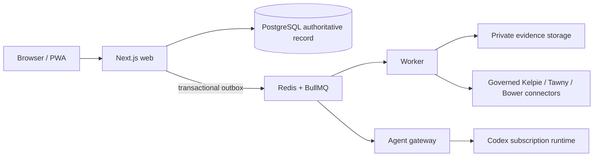

<p align="center">
  
</p>

<h1 align="center">Muster</h1>

> The governed workspace for human and agent-assisted security operations.

Muster brings alerts, investigations, approvals, evidence, task work, and
connector activity into durable security rooms. PostgreSQL is its authoritative
record; agents and queues execute bounded work around that record. Muster is a
coordination layer, not a replacement SIEM, EDR, SOAR, or case-management
product.


The screenshot is a committed synthetic demo asset. It contains fictional
people, cases, and indicators only; do not treat it as a production capture.

## Where Muster fits

Muster intentionally leaves each adjacent product authoritative for its own
domain:

- [Kelpie](https://github.com/jusso-dev/Kelpie) owns formal incident cases and
  case lifecycle. Muster links case identifiers and posts governed case work;
  it does not become the case system of record.
- [Tawny](https://github.com/jusso-dev/tawny) owns endpoint telemetry,
  detections, bounded hunts, and approved endpoint response. Muster stores the
  request, approval, delivery, and evidence references around that work.
- [Bower](https://github.com/jusso-dev/bower) owns application and legacy
  telemetry delivery health. Muster presents its signals in operational rooms.

## Current, verified surface

The current application has room timelines, threads, reactions, mentions,
durable tasks, investigations, approvals, evidence upload, search, SSE updates,
agent readiness/activity, and responsive PWA navigation. The browser suite
exercises the room lifecycle, task delegation, approvals, agent activity,
governed connectors, clean install, accessibility, and mobile layouts; see
[`tests/`](tests). The health endpoint is
[`/api/v1/health`](apps/web/app/api/v1/health/route.ts).

### Task board and starter missions

[`/tasks`](apps/web/app/tasks/page.tsx) reads only organisation-scoped tasks.
It presents task status, assignment, run state, events, and governed delegation;
delegation carries an idempotency key and its result remains attached to that
task. It is not an autonomous-work queue: users with the applicable server-side
capabilities create, assign, delegate, review, or cancel bounded work. Any
connector-side action still needs its own capability and approval record.

Starter agent definitions are installed with a clean database. Their work is
bounded by an explicit task, approved schedule, or configured watchlist and
remains reviewable through the [`/tasks` board](apps/web/app/tasks/page.tsx);
no agent is an unbounded background operator:

- **Alfie** — evidence-backed threat and technology research. Administrators
  create bounded, allowlisted watchlists at
  [`/settings/alfie-research`](apps/web/app/settings/alfie-research/page.tsx); see the
  [research runbook](docs/operations/alfie-research.md). It reads allowlisted
  HTTPS feeds only, produces source-backed briefs, and does not perform external
  actions. A starter mission: summarise a named technology from an approved
  watchlist, then review its citations and feedback state.
- **Jessie** — bounded threat hunts and proposed Kelpie enrichment. It refuses
  to run without a configured governed source; broader time, record, or
  multi-source plans wait for human approval. A starter mission: investigate a
  specific alert question, review recorded evidence and gaps, then decide
  whether to approve the exact hunt or proposed enrichment.
- **Parker** — operational reporting with organisation-scoped weekly or
  monthly schedules at [`/settings/parker-reports`](apps/web/app/settings/parker-reports/page.tsx).
  A due occurrence creates one Parker-assigned review task; delegating that task
  produces a reproducible report manifest, review/version record, and room post.
  Email delivery remains separately approved. See the
  [Parker report runbook](docs/operations/parker-reports.md). A starter mission:
  prepare an analyst, leadership, or executive report for a selected room and
  period, then review the manifest before approving delivery.

For a disposable evaluation, create three explicit tasks rather than treating
the agents as autonomous staff: ask Alfie to summarise an allowlisted research
topic with citations, Jessie to perform a bounded hunt against a linked alert,
and Parker to prepare a leadership report for a selected room and period.
Review the resulting evidence, run record, room post, and any approval before
acting. The committed demo data is synthetic and separate from a clean install.

All external actions remain server-side capability checked and approval gated.
Codex receives read-only, no-network execution with typed output validation;
it cannot directly perform connector writes.

### Mock and real connector status

Both supplied Compose topologies set `MUSTER_MOCK_INTEGRATIONS=true` and start
synthetic Kelpie, Tawny, and Bower services. Their replies are demo/test data;
a mock health check, query, or action result is never production delivery.

| Product | Supplied Compose default | Configured endpoint surface                                                                                                          | Real status                                                              |
| ------- | ------------------------ | ------------------------------------------------------------------------------------------------------------------------------------ | ------------------------------------------------------------------------ |
| Kelpie  | Synthetic mock           | [`/integrations/connectors`](apps/web/app/integrations/connectors/page.tsx) has governed Kelpie query/case-management configuration. | Code and contract tests exist; no live-product certification is claimed. |
| Tawny   | Synthetic mock           | Connector administration supports read-only Tawny and separately governed Tawny-response configuration.                              | Code and contract tests exist; no live-product certification is claimed. |
| Bower   | Synthetic mock           | No Bower option exists in connector administration; product pages are demo-only.                                                     | Mock/demo only; do not treat it as a configured production connector.    |

Configured Kelpie and Tawny credentials are stored server-side per organisation;
each endpoint, capability, and approval path must be validated in the target
environment. See [current upstream contracts](docs/integrations/current-upstream-contracts.md).

## Clean Docker quick start

Supported host: Intel/AMD64 Ubuntu with Docker Engine and the Compose plugin.
The clean installer creates a fresh database, object store, local administrator,
and agent definitions; it does **not** seed synthetic alerts, cases, messages,
or tasks.

```bash
git clone https://github.com/jusso-dev/Muster.git
cd Muster
./scripts/bootstrap.sh
```

Open `http://localhost:3000`. The script writes `.env` locally and prints the
generated administrator password. The value is local `.env` state, not a demo
credential: do not commit it and change it for any non-disposable installation.
Local Compose exposes PostgreSQL, Redis, MinIO, Mailpit, the web application,
and synthetic connector mocks for development; it is not a hardened
Internet-facing topology.

For source-based development instead:

```bash
pnpm install --frozen-lockfile
pnpm db:migrate
pnpm db:bootstrap
pnpm dev
```

### Demo and screenshots are separate

Only populate a disposable database when explicitly preparing tests or
screenshots:

```bash
MUSTER_DEMO_MODE=true NEXT_PUBLIC_MUSTER_DEMO_MODE=true pnpm db:seed
```

Never run that command against a production or clean-install database.

| Mode            | Data and route behaviour                                                                                                                                                                      |
| --------------- | --------------------------------------------------------------------------------------------------------------------------------------------------------------------------------------------- |
| Clean install   | `bootstrap.sh` creates local configuration, an administrator, starter rooms, and starter agent definitions. It does not seed synthetic alerts, cases, messages, tasks, or a fixed demo login. |
| Demo/screenshot | `MUSTER_DEMO_MODE=true` plus `pnpm db:seed` adds synthetic data. Product integration and workflow views are demo-only and redirect in clean mode.                                             |

## Homelab image install (port 3004)

The public image is built for `linux/amd64`; CI publishes SBOM/provenance and
verifies an anonymous GHCR pull on `main`. Use a reviewed OCI digest, not
`latest`. At this README revision, the published `sha-a37ea88` image resolves to
`ghcr.io/jusso-dev/muster@sha256:75ebdad962373ff1fa5dbef8dba8f0a005de6058e21655dad8c72b1129e90861`.
Verify that digest or replace it with a newer reviewed release before deployment.

```bash
git clone https://github.com/jusso-dev/Muster.git
cd Muster
MUSTER_PUBLIC_URL=http://muster.example.lan:3004 \
AUTH_TRUSTED_ORIGINS=http://muster.example.lan:3004 \
MUSTER_IMAGE=ghcr.io/jusso-dev/muster@sha256:75ebdad962373ff1fa5dbef8dba8f0a005de6058e21655dad8c72b1129e90861 \
./scripts/install-homelab.sh
```

`install-homelab.sh` persists an explicitly supplied `MUSTER_IMAGE` or legacy
`MUSTER_VERSION` in `.env.homelab`; inspect that file before later upgrades.
For a newer release, change the persisted reference only after its image,
SBOM/provenance, migrations, and rollback path have been reviewed.

The homelab Compose file publishes only web port `3004` by default and keeps
PostgreSQL, Redis, MinIO, Mailpit, worker, gateway, and mocks internal. Set
`MUSTER_PUBLIC_URL` and `AUTH_TRUSTED_ORIGINS` to the exact browser origin(s)
that will use the service. When using HTTPS behind a reverse proxy, set
`AUTH_SECURE_COOKIES=true`; do not add broad wildcard origins.

The installer creates `.env.homelab` with mode `600`. Keep it out of source
control. The generated topology still uses synthetic connector endpoints until
you deliberately configure governed real connectors.

### Codex subscription authentication

Agents use a ChatGPT Codex subscription, not an OpenAI API key. Authenticate
the private persistent volume interactively after the stack is running:

```bash
docker compose --profile setup run --rm codex-login
```

For the homelab topology, use its Compose file and generated environment file:

```bash
docker compose --env-file .env.homelab \
  -f deploy/docker/docker-compose.homelab.yml \
  --profile setup run --rm codex-login
```

The normal Compose gateway and setup job share the private `muster-codex`
volume; the homelab topology calls the same private state volume `codex-state`.
Do not mount either volume into the web service, copy its contents into a
repository, or print it in logs. If no authorised Codex session exists, agent
readiness correctly reports that limitation rather than pretending a run worked.

## Operating model



Redis and BullMQ are execution infrastructure, not a source of truth. Significant
state changes, audit events, and outbox records are written transactionally.
Incoming connector content is untrusted evidence, not agent instruction.

Read the [architecture](docs/architecture/README.md),
[connector contract notes](docs/integrations/current-upstream-contracts.md), and
[OpenAPI description](docs/openapi.yaml) before extending integrations. The
[deployment guide](docs/operations/deployment.md) explains the supported
single-node/evaluation topology; [CONTRIBUTING.md](CONTRIBUTING.md) defines the
required design, test, migration, and rollback review for changes.

## Security and operations

- Every domain query is organisation scoped; routes, workers, and agent tools
  perform server-side capability checks.
- Dangerous actions require approval records. Evidence uses private object
  storage, hash verification, classification, quarantine metadata, and audit
  history.
- Agent learning is evidence-backed, versioned, evaluated, approved, and
  reversible; it cannot grant new permissions or tools.
- Review [SECURITY.md](SECURITY.md), the [threat model](docs/security/threat-model.md),
  [authentication and capabilities](docs/security/authentication-and-capabilities.md),
  and [agent safety](docs/security/agent-safety.md) before deployment.

Back up PostgreSQL and the versioned evidence bucket; Redis is rebuildable.
The required restore order and verification checks are in
[backup and restore](docs/operations/backup-restore.md). For a suspected Muster
compromise, follow [incident recovery](docs/operations/incident-recovery.md).

### Troubleshooting

- **Web is unhealthy:** run `docker compose ps`, then inspect the failing
  service logs. For homelab use `docker compose --env-file .env.homelab -f
deploy/docker/docker-compose.homelab.yml ps`. The web health route is
  `/api/v1/health`; see the [deployment guide](docs/operations/deployment.md).
- **Login loops or callback errors:** verify `MUSTER_PUBLIC_URL`,
  `AUTH_TRUSTED_ORIGINS`, reverse-proxy headers, and `AUTH_SECURE_COOKIES`; then
  restart the web service.
- **Agent is not ready:** use the Agents view to distinguish missing Codex
  authentication from disabled/readiness evidence. Re-run `codex-login` only
  on the private volume; see [deployment guidance](docs/operations/deployment.md).
- **Connector delivery does not happen:** confirm it is not a mock, then check
  the connector health, organisation capability, approval record, outbox, and
  upstream product logs. Do not replay raw queue jobs.

## Known limits and roadmap

Muster is an MVP reference implementation. It does not make the local Compose
topology production-ready: plan identity policy, TLS/reverse proxy, egress
controls, malware scanning, object lock/retention, backup restore exercises,
monitoring, and high availability for your environment. The default external
products are mocks. A first-class Slack surface and portable external agent
harnesses are upcoming work tracked in [#33](https://github.com/jusso-dev/Muster/issues/33): there is no Slack app/event endpoint or external harness contract to configure yet.

## Testing and contribution checks

For source tests, use Node 24+, pnpm 11.17.0, Docker, and installed Chromium
browser dependencies. The application, worker, and gateway test servers are
started by Playwright; PostgreSQL and Redis are the required local services.

```bash
pnpm install --frozen-lockfile
docker compose up -d postgres redis minio minio-init
pnpm db:migrate
pnpm db:bootstrap
pnpm check
pnpm exec playwright install --with-deps chromium
pnpm test:e2e -- --project=chromium
pnpm exec playwright test --config=playwright.clean.config.ts
```

The clean-install suite proves that no synthetic demo data is required. The
standard suite uses synthetic mocks and test mode; it is not real-connector
certification. Run `pnpm screenshots` only against synthetic data. Before
submitting a change, follow [CONTRIBUTING.md](CONTRIBUTING.md), keep the
organisation/capability/approval boundaries intact, and include the relevant
unit, integration, browser, migration, and rollback evidence.

CI currently runs clean-install and synthetic-demo browser checks with Chromium
on Ubuntu `linux/amd64`. `pnpm test:e2e` also defines local Firefox, WebKit, and
iPhone 13-emulation projects; those projects are useful regression checks, not
a claim of a production-browser support or connector-certification matrix.

## Additional verification commands

```bash
pnpm lint
pnpm typecheck
pnpm test
pnpm build
pnpm test:e2e
pnpm screenshots
```

## License

Apache-2.0. See [LICENSE](LICENSE).
