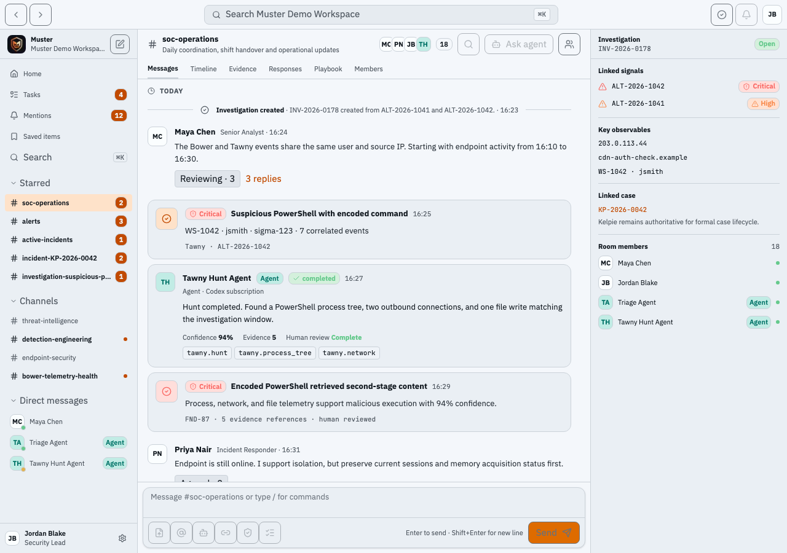
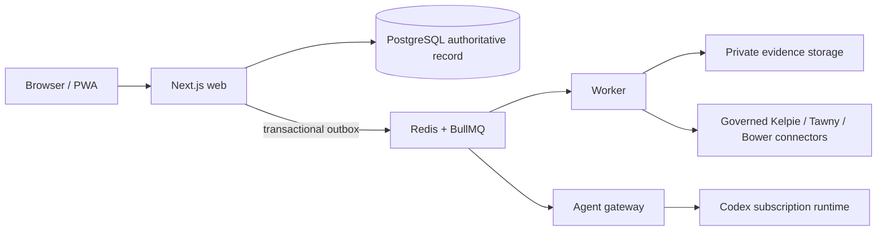

<p align="center">
  
</p>

<h1 align="center">Muster</h1>

> The governed workspace for human and agent-assisted security operations.

Muster brings alerts, investigations, approvals, evidence, task work, and
connector activity into durable security rooms. PostgreSQL is its authoritative
record; agents and queues execute bounded work around that record. Muster is a
coordination layer, not a replacement SIEM, EDR, SOAR, or case-management
product.



The screenshot is a committed synthetic demo asset. It contains fictional
people, cases, and indicators only; do not treat it as a production capture.

## Where Muster fits

Muster intentionally leaves each adjacent product authoritative for its own
domain:

- [Kelpie](https://github.com/jusso-dev/Kelpie) owns formal incident cases and
  case lifecycle. Muster links case identifiers and posts governed case work;
  it does not become the case system of record.
- [Tawny](https://github.com/jusso-dev/tawny) owns endpoint telemetry,
  detections, bounded hunts, and approved endpoint response. Muster stores the
  request, approval, delivery, and evidence references around that work.
- [Bower](https://github.com/jusso-dev/bower) owns application and legacy
  telemetry delivery health. Muster presents its signals in operational rooms.

## Current, verified surface

The current application has room timelines, threads, reactions, mentions,
durable tasks, investigations, approvals, evidence upload, search, SSE updates,
agent readiness/activity, and responsive PWA navigation. The browser suite
exercises the room lifecycle, task delegation, approvals, agent activity,
governed connectors, clean install, accessibility, and mobile layouts; see
[`tests/`](tests). The health endpoint is
[`/api/v1/health`](apps/web/app/api/v1/health/route.ts).

Starter agent definitions are installed with a clean database. Their work is
bounded by an explicit task, approved schedule, or configured watchlist and
remains reviewable through the [`/tasks` board](apps/web/app/tasks/page.tsx);
no agent is an unbounded background operator:

- **Alfie** — evidence-backed threat and technology research. Administrators
  create bounded, allowlisted watchlists at
  [`/settings/alfie-research`](apps/web/app/settings/alfie-research/page.tsx); see the
  [research runbook](docs/operations/alfie-research.md).
- **Jessie** — bounded threat hunting and proposed Kelpie enrichment, with
  source limits and approval for broader plans.
- **Parker** — operational reporting with organisation-scoped weekly or
  monthly schedules at [`/settings/parker-reports`](apps/web/app/settings/parker-reports/page.tsx).
  Each run produces a reproducible report manifest, review/version record, and
  room post; email delivery remains separately approved. See the
  [Parker report runbook](docs/operations/parker-reports.md).

For a disposable evaluation, create three explicit tasks rather than treating
the agents as autonomous staff: ask Alfie to summarise an allowlisted research
topic with citations, Jessie to perform a bounded hunt against a linked alert,
and Parker to prepare a leadership report for a selected room and period.
Review the resulting evidence, run record, room post, and any approval before
acting. The committed demo data is synthetic and separate from a clean install.

All external actions remain server-side capability checked and approval gated.
Codex receives read-only, no-network execution with typed output validation;
it cannot directly perform connector writes.

### Mock and real integrations

The root Compose topology starts **synthetic Kelpie, Tawny, and Bower mocks**.
They are for local development and screenshots only. A mock success is not a
real product delivery. Real governed connectors are configured per organisation
through the application and require valid endpoint, credential, capability,
and approval state. Validate upstream versions and credentials before any
operational use.

## Clean Docker quick start

Supported host: Intel/AMD64 Ubuntu with Docker Engine and the Compose plugin.
The clean installer creates a fresh database, object store, local administrator,
and agent definitions; it does **not** seed synthetic alerts, cases, messages,
or tasks.

```bash
git clone https://github.com/jusso-dev/Muster.git
cd Muster
./scripts/bootstrap.sh
```

Open `http://localhost:3000`. The script writes `.env` locally and prints the
generated administrator password once. Treat that output as a secret and change
it for any non-disposable installation. Local Compose exposes PostgreSQL,
Redis, MinIO, Mailpit, the web application, and synthetic connector mocks for
development; it is not a hardened Internet-facing topology.

For source-based development instead:

```bash
pnpm install --frozen-lockfile
pnpm db:migrate
pnpm db:bootstrap
pnpm dev
```

### Demo and screenshots are separate

Only populate a disposable database when explicitly preparing tests or
screenshots:

```bash
MUSTER_DEMO_MODE=true NEXT_PUBLIC_MUSTER_DEMO_MODE=true pnpm db:seed
```

Never run that command against a production or clean-install database.

## Homelab image install (port 3004)

The public image is built for `linux/amd64`; CI publishes SBOM/provenance and
verifies an anonymous GHCR pull on `main`. Use an immutable SHA tag or digest
in production, not `latest`. For example, set `MUSTER_VERSION` to the published
`sha-<short-commit>` tag for the release you have reviewed.

```bash
git clone https://github.com/jusso-dev/Muster.git
cd Muster
MUSTER_PUBLIC_URL=http://muster.example.lan:3004 \
AUTH_TRUSTED_ORIGINS=http://muster.example.lan:3004 \
MUSTER_VERSION=sha-REPLACE_WITH_REVIEWED_COMMIT \
./scripts/install-homelab.sh
```

The homelab Compose file publishes only web port `3004` by default and keeps
PostgreSQL, Redis, MinIO, Mailpit, worker, gateway, and mocks internal. Set
`MUSTER_PUBLIC_URL` and `AUTH_TRUSTED_ORIGINS` to the exact browser origin(s)
that will use the service. When using HTTPS behind a reverse proxy, set
`AUTH_SECURE_COOKIES=true`; do not add broad wildcard origins.

The installer creates `.env.homelab` with mode `600`. Keep it out of source
control. The generated topology still uses synthetic connector endpoints until
you deliberately configure governed real connectors.

### Codex subscription authentication

Agents use a ChatGPT Codex subscription, not an OpenAI API key. Authenticate
the private persistent volume interactively after the stack is running:

```bash
docker compose --profile setup run --rm codex-login
```

The normal Compose gateway and setup job share the private `muster-codex`
volume; the homelab topology calls the same private state volume `codex-state`.
Do not mount either volume into the web service, copy its contents into a
repository, or print it in logs. If no authorised Codex session exists, agent
readiness correctly reports that limitation rather than pretending a run worked.

## Operating model



Redis and BullMQ are execution infrastructure, not a source of truth. Significant
state changes, audit events, and outbox records are written transactionally.
Incoming connector content is untrusted evidence, not agent instruction.

Read the [architecture](docs/architecture/README.md),
[connector contract notes](docs/integrations/current-upstream-contracts.md), and
[OpenAPI description](docs/openapi.yaml) before extending integrations. The
[deployment guide](docs/operations/deployment.md) explains the supported
single-node/evaluation topology; [CONTRIBUTING.md](CONTRIBUTING.md) defines the
required design, test, migration, and rollback review for changes.

## Security and operations

- Every domain query is organisation scoped; routes, workers, and agent tools
  perform server-side capability checks.
- Dangerous actions require approval records. Evidence uses private object
  storage, hash verification, classification, quarantine metadata, and audit
  history.
- Agent learning is evidence-backed, versioned, evaluated, approved, and
  reversible; it cannot grant new permissions or tools.
- Review [SECURITY.md](SECURITY.md), the [threat model](docs/security/threat-model.md),
  [authentication and capabilities](docs/security/authentication-and-capabilities.md),
  and [agent safety](docs/security/agent-safety.md) before deployment.

Back up PostgreSQL and the versioned evidence bucket; Redis is rebuildable.
The required restore order and verification checks are in
[backup and restore](docs/operations/backup-restore.md). For a suspected Muster
compromise, follow [incident recovery](docs/operations/incident-recovery.md).

### Troubleshooting

- **Web is unhealthy:** run `docker compose ps`, then inspect the failing
  service logs. The web health route is `/api/v1/health`.
- **Login loops or callback errors:** verify `MUSTER_PUBLIC_URL`,
  `AUTH_TRUSTED_ORIGINS`, reverse-proxy headers, and `AUTH_SECURE_COOKIES`; then
  restart the web service.
- **Agent is not ready:** use the Agents view to distinguish missing Codex
  authentication from disabled/readiness evidence. Re-run `codex-login` only
  on the private volume.
- **Connector delivery does not happen:** confirm it is not a mock, then check
  the connector health, organisation capability, approval record, outbox, and
  upstream product logs. Do not replay raw queue jobs.

## Known limits and roadmap

Muster is an MVP reference implementation. It does not make the local Compose
topology production-ready: plan identity policy, TLS/reverse proxy, egress
controls, malware scanning, object lock/retention, backup restore exercises,
monitoring, and high availability for your environment. The default external
products are mocks. A first-class Slack surface and portable external agent
harnesses are upcoming work tracked in [#33](https://github.com/jusso-dev/Muster/issues/33): there is no Slack app/event endpoint or external harness contract to configure yet.

## Testing and contribution checks

For source tests, use Node 24+, pnpm 11.17.0, Docker, and installed Chromium
browser dependencies. The application, worker, and gateway test servers are
started by Playwright; PostgreSQL and Redis are the required local services.

```bash
pnpm install --frozen-lockfile
docker compose up -d postgres redis
pnpm db:migrate
pnpm db:bootstrap
pnpm check
pnpm exec playwright install --with-deps chromium
pnpm test:e2e -- --project=chromium
pnpm exec playwright test --config=playwright.clean.config.ts
```

The clean-install suite proves that no synthetic demo data is required. The
standard suite uses synthetic mocks and test mode; it is not real-connector
certification. Run `pnpm screenshots` only against synthetic data. Before
submitting a change, follow [CONTRIBUTING.md](CONTRIBUTING.md), keep the
organisation/capability/approval boundaries intact, and include the relevant
unit, integration, browser, migration, and rollback evidence.

## Additional verification commands

```bash
pnpm lint
pnpm typecheck
pnpm test
pnpm build
pnpm test:e2e
pnpm screenshots
```

## License

Apache-2.0. See [LICENSE](LICENSE).
