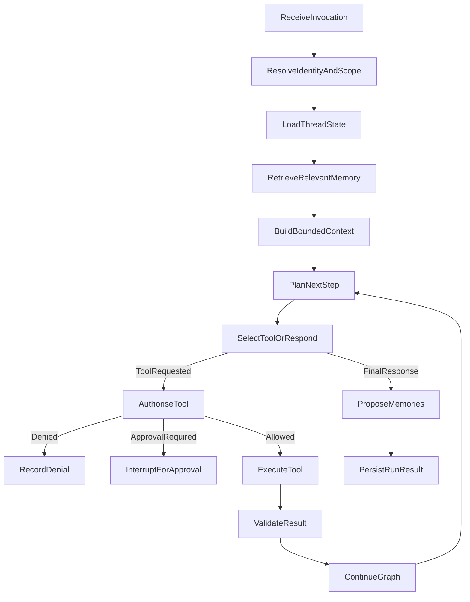

# ADR 0005: Stateful agent runtime on LangGraph

Status: accepted

## Context

The Codex subscription runtime (ADR 0004) treats one invocation as one bounded
prompt: an empty workspace, a single Codex thread, a required output schema,
and a durable `agent_runs` row that PostgreSQL claims, leases, and settles.
That model has no first-class node for a multi-step tool loop, no resumable
execution state, and no way to distinguish a transient infrastructure failure
from a policy denial or an invalid model response inside one run. As agents
take on tool-using, multi-turn, and human-approval-gated work, Muster needs an
execution shape that survives a worker restart, deduplicates external actions
across a resume, and can be governed by a graph version rather than by prompt
text alone.

The harness already guarantees the invocation boundary: `@muster/agent-harness`
resolves the actor, capability, room, and budget context, creates the durable
`agent_runs` row and its idempotency key, and is the only entry point every
adapter (HTTP, Slack, MCP, CLI, Hermes) uses. That boundary does not need to
change. What is missing is a governed way to execute a run as a graph of steps
that can pause, resume, and recover, while every authoritative fact about the
run still lives in PostgreSQL.

## Decision

A new package, `packages/agent-runtime` (`@muster/agent-runtime`), implements
run execution with LangGraph v1 (`@langchain/langgraph` `1.4.8`, on
`@langchain/core` `1.1.48` and `@langchain/langgraph-checkpoint` `1.1.3`). It
operates strictly behind `@muster/agent-harness`, which remains the only
public invocation boundary. The harness still resolves identity, capability,
room, and budget context and creates the authoritative run row before the
graph runs; nothing calls the LangGraph runtime directly, and no adapter gains
a second, ungoverned path to start or resume execution.

### Source of truth

PostgreSQL stays authoritative for identity, organisation boundaries, agent
definitions, enablement and kill switches, capabilities, tool permissions,
approval records, tasks, investigations, evidence, external actions, audit,
and the final agent run status. LangGraph checkpoints hold only execution
state: the current node, model messages, tool-call progress, a bounded context
summary, a pending interrupt, retry position, and execution metadata. A
checkpoint is never consulted to decide whether an agent is enabled, whether a
tool is permitted, or what a run's final status is; those questions are always
re-asked of PostgreSQL through the runtime's ports (`RuntimeGuardPort`,
`AgentDirectoryPort`, `ApprovalPort`, `ToolPolicyPort`, `RunRecordPort`).

Checkpoints and checkpoint writes are themselves persisted to PostgreSQL, in
`agent_runtime_checkpoints` and `agent_runtime_checkpoint_writes`, so a worker
restart resumes from the same durable state without a second store to keep
consistent with the run row. Every checkpoint row carries `organisation_id`,
`agent_id`, `conversation_id`, `run_id`, and the `graph_version` that wrote it.
The related `agent_runs` columns `graph_version`, `conversation_id`,
`checkpoint_thread_id`, and `pending_approval_id` stay nullable so runs
created by the existing Codex executor keep resolving against the same
authoritative row; only runs the stateful runtime starts populate them.
`agent_tool_calls` gains `tool_call_id`, `idempotency_key`, `checkpoint_id`,
and a `result` column so a resumed run can reserve, and then replay, the
outcome of an external action instead of repeating it. Only redacted results
are stored there; raw evidence stays untrusted data, never a checkpoint or
tool-call payload.

### Tenancy

Every checkpoint namespace carries the full tenant path:
`organisation_id / agent_id / conversation_id / run_id`. Two derived
identifiers make that path explicit everywhere the graph and its ports
exchange state:

- Thread id: `muster:{organisationId}:{agentId}:{conversationId}`
- Run namespace: `muster:{organisationId}:{agentId}:{runId}`

`RuntimeScope` (`organisationId`, `agentId`, `conversationId`, `runId`) is
validated with `zod` and is the only shape ports accept; identifiers are
derived from authoritative state, never accepted from a model or from
external content. No checkpoint or memory query may run without an
organisation. This is enforced structurally, not by convention alone:

- The checkpoint saver is tenant-scoped, so every read, write, and list
  operation predicate includes `organisation_id` before it includes anything
  else.
- Every port method that touches a row (`MemoryPort.retrieve`,
  `ApprovalPort.require`/`read`, `ToolExecutionPort.reserve`/`execute`/
  `settle`, `RunRecordPort.emit`/`persistResult`/`list`) takes the full scope
  and applies an organisation predicate.
- `parseThreadId` and `assertThreadBelongsToOrganisation` parse a thread
  identifier LangGraph hands back through its configurables and throw a
  `CheckpointScopeViolationError` if its organisation segment does not match
  the organisation the checkpoint saver was constructed for. This is defence
  in depth on top of already organisation-scoped SQL predicates: a thread id
  that does not belong to the calling organisation is rejected before any row
  is touched, not after.

### Graph shape

`ReceiveInvocation` and `ResolveIdentityAndScope` re-establish the
`RuntimeScope` and re-check `RuntimeGuardPort.assertRunnable` for the run
before any model or tool step, not only at claim time. `LoadThreadState` reads
the LangGraph checkpoint for the thread. `RetrieveRelevantMemory` calls
`MemoryPort.retrieve`, which is organisation- and agent-scoped and never
crosses a tenant. `BuildBoundedContext` assembles the bounded prompt from
typed `ModelMessage` parts (see Model-provider portability, below).
`PlanNextStep` and `SelectToolOrRespond` call the model router. A tool
proposal goes through `AuthoriseTool` (`ToolPolicyPort.authorise`), which can
resolve to denial (`RecordDenial`), a required approval
(`InterruptForApproval`, which calls `ApprovalPort.require` and
`RunRecordPort.markAwaitingApproval`, then stops the graph on a LangGraph
interrupt), or an allowed call that proceeds to `ExecuteTool`,
`ValidateResult`, and back through `ContinueGraph` to `PlanNextStep`. A final
response instead moves to `ProposeMemories` (`MemoryPort.propose`, proposals
only) and `PersistRunResult` (`RunRecordPort.persistResult`).

### Graph versioning and resume policy

`AGENT_RUNTIME_GRAPH_VERSION` (`muster.agent-runtime.graph/1`) is stamped on
every run and every checkpoint. A run always resumes against the graph
version it started with: `checkGraphVersion` compares the recorded version
against `resumableGraphVersions` (versions whose checkpoint shape is
byte-compatible with the current graph) and `retiredGraphVersions` (versions
that were written by an older graph and can no longer be resumed). A run with
no recorded version, an unknown version, or a version present in
`retiredGraphVersions` fails closed with `graph_version_mismatch` and an
explicit migration requirement (`migrationRequired: true`) rather than
silently replaying a run against a graph it never executed. Retiring a
version is a deliberate operator action: bump the constant, add the retired
version and its migration reason to the map, and any run still on that
version stops resuming until it is migrated or explicitly closed out.

### Failure taxonomy

Retry behaviour distinguishes four failure classes, defined once in
`runtimeFailureClasses` and mapped from every `RuntimeFailureCode`:

- **transient** — infrastructure failure that can be retried without
  changing anything about the request: `model_provider_unavailable`,
  `runtime_error`, `stale_run`, `tool_execution_failed`.
- **policy** — the request was understood but is not permitted:
  `agent_kill_switch`, `agent_inactive`, `policy_denied`, `tool_not_registered`,
  `unknown_tool`.
- **invalid_model_output** — the model produced something that does not
  satisfy the runtime's contracts: `invalid_json`, `invalid_model_output`,
  `invalid_tool_arguments`.
- **permanent** — the run cannot proceed regardless of retry:
  `cancelled`, `checkpoint_scope_violation`, `graph_version_mismatch`,
  `model_provider_not_configured`, `no_model_policy_match`, `step_ceiling`,
  `timeout`.

Only `transient` failures are retried (`isRetryable`); `policy` and
`invalid_model_output` surface as governance and validation outcomes rather
than being retried as if they were infrastructure noise, and `permanent`
failures stop the run.

### Model-provider portability

Agent definitions select a `ModelPolicy` (`preferred`, optional `fallback`,
`allowLocal`, `maxInputTokens`, `maxOutputTokens`, optional `temperature`), a
capability class such as `reasoning-large`, `general-medium`, or
`fast-small` — never a vendor model name or a specific provider. A
`ModelRouter` resolves a policy to whichever configured `ModelProvider`
satisfies it, honouring fallback order, so an agent keeps running when a
provider is swapped, rate limited, or removed. Provider kinds are
`openai-compatible`, `anthropic`, `ollama`, `openrouter`, `codex`, and
`scripted` (the last for deterministic tests). A provider's `local` flag is
only ever honoured when the policy sets `allowLocal: true`; `configured()`
reports `false` when required configuration is absent and never throws on a
missing secret. Prompt parts carry an explicit `ModelMessageRole`
(`system_policy`, `trusted_instruction`, `human_request`, `agent_response`,
`untrusted_evidence`, `tool_result`) so the trust boundary between a system
policy and untrusted evidence or a tool result stays explicit all the way to
the provider adapter; no adapter is permitted to promote `untrusted_evidence`
or `tool_result` content into a `system_policy` or `trusted_instruction`
position.

### Security boundaries

- No model-generated tool name is trusted. `ToolPolicyPort.authorise` rejects
  unregistered names, names outside the agent's allowlist, and missing
  capabilities before any argument is considered.
- Tool arguments are validated against the tool's registered schema;
  `ToolAuthorisationDecision` only carries `validatedArguments`, never the
  model's raw arguments, forward.
- Connector secrets never enter runtime context or a checkpoint. Ports pass
  identifiers and validated arguments, not credentials; checkpoints hold
  execution metadata only, as described under Source of truth.
- Raw evidence retrieved through a tool remains untrusted data. It is
  attached to the graph as `untrusted_evidence`/`tool_result` messages, never
  promoted to `system_policy` or `trusted_instruction`, matching ADR 0003's
  rule that external content cannot become a trusted instruction.
- Tool results never become system instructions, for the same reason.
- Models cannot modify capabilities, alter approval requirements, or write to
  authoritative business tables. Every write to an authoritative table
  (approvals, tool-call records, run status) goes through a port backed by a
  server-side implementation the graph cannot bypass.
- The kill switch stops new model and tool steps immediately:
  `RuntimeGuardPort.assertRunnable` is re-evaluated at every graph step
  boundary, not only when a run is first claimed.
- Every privileged step is attributable. Tool authorisation and execution
  ports take an `AuthorisationSubject` alongside the `RuntimeScope`, so an
  authorised call, a denial, and an approval requirement are each tied to the
  subject that produced them, not only to the agent.

### Runtime events and the closed event vocabulary

The `AgentRuntime` API is `startRun`, `resumeRun`, `cancelRun`, `streamRun`,
and `inspectRun`. It emits a closed set of events —
`run.queued`, `run.started`, `model.started`, `model.completed`,
`tool.proposed`, `tool.approval_required`, `tool.started`, `tool.progress`,
`tool.completed`, `tool.failed`, `memory.proposed`, `run.completed`,
`run.failed`, `run.cancelled` — defined once as a discriminated union.
`sanitiseRuntimeEvent` reduces any candidate event to exactly the fields its
type allows, so a node cannot leak an extra field onto a stream, a room
timeline, or Slack. Hidden chain-of-thought and raw model reasoning are never
event fields and are never part of the vocabulary above; `tool.progress` is
the only event carrying free text, and that text is passed through
`redactObservationText` and bounded to 2,000 characters before it can reach a
stream.

## Consequences

Introducing `@muster/agent-runtime` behind the existing harness lets Muster
run resumable, tool-using, approval-gated agent work without adding a second
invocation path or weakening any organisation, capability, or approval gate
already enforced by the harness and PostgreSQL. Operators opt in per
deployment by setting `MUSTER_AGENT_RUNTIME=graph` on the agent gateway;
`codex` remains the default and `mock` remains available for deterministic
tests, so existing deployments are unaffected until an operator explicitly
switches an agent's runtime. Rolling back is setting `MUSTER_AGENT_RUNTIME`
back to `codex` (or `mock`); in-flight graph runs on a retired or rolled-back
build fail closed with an explicit `graph_version_mismatch` migration
requirement rather than silently resuming against a graph that no longer
matches their checkpoint shape, so a rollback cannot resurrect a run against
the wrong version.

The cost of this approach is a second execution model to maintain alongside
the Codex executor, and a wider set of ports (`RuntimeGuardPort`,
`AgentDirectoryPort`, `MemoryPort`, `ApprovalPort`, `ToolPolicyPort`,
`ToolExecutionPort`, `RunRecordPort`) that every future graph node must be
built against rather than reaching PostgreSQL directly. Test doubles satisfy
those ports without weakening any gate they represent.
