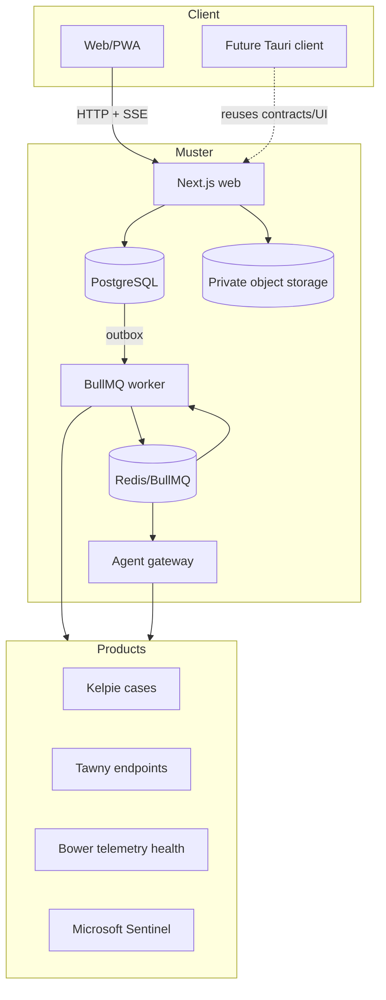
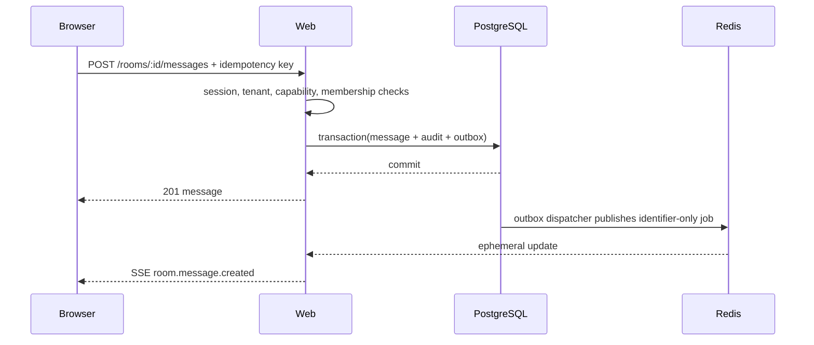
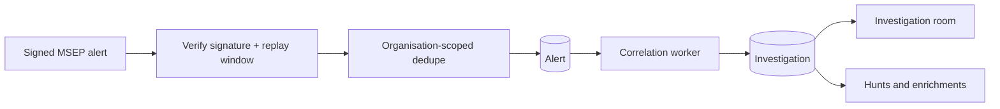
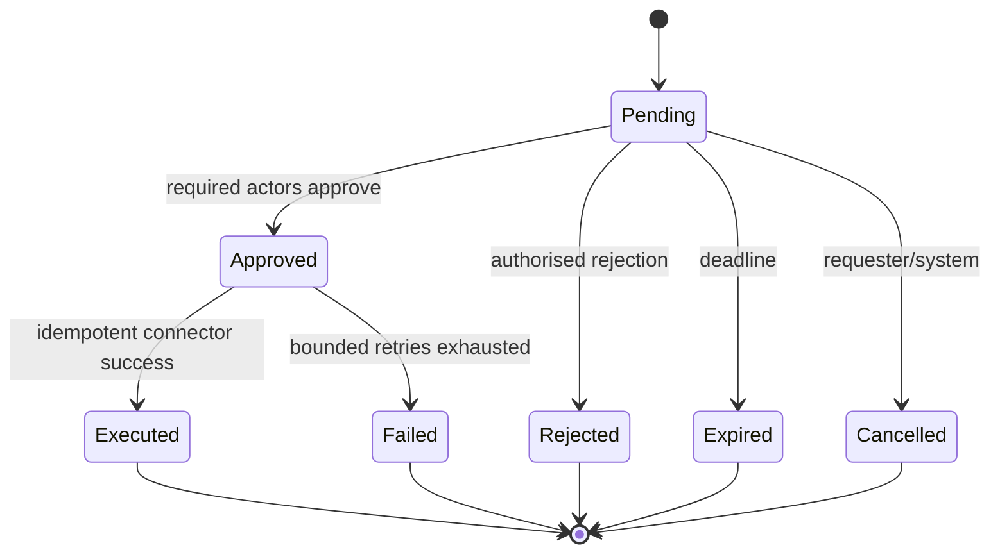
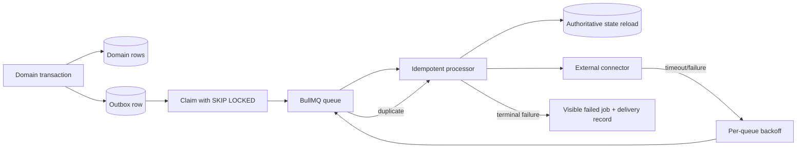
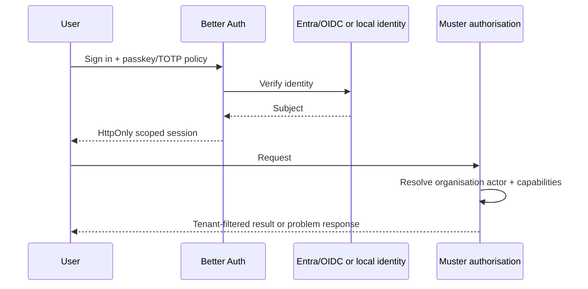
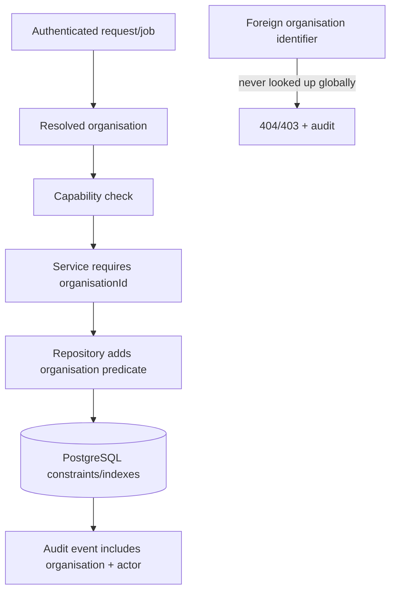

# Muster architecture

Muster is a TypeScript-first modular monolith with process boundaries: browser-facing
ops web UI, MCP server, asynchronous worker, and isolated agent gateway. Packages own
domain logic; PostgreSQL owns durable state.

Chat is not the web product: Slack + Hermes own conversation. See
[ADR 0006](0006-ops-control-plane-ui.md).

## System



## Room message flow



## Alert to investigation



## Investigation to Kelpie

```mermaid
sequenceDiagram
  participant A as Analyst
  participant M as Muster
  participant K as Kelpie
  A->>M: Request promotion
  M->>M: Create approval and room/timeline event
  A->>M: Approve with investigations.promote
  M->>K: Idempotent case-create request
  K-->>M: Authoritative case number/version
  M->>M: Link case; audit; preserve pre-case context
  M->>K: Apply selected playbook/timeline references
```

## Agent invocation

```mermaid
sequenceDiagram
  participant H as Human/workflow
  participant W as Web/worker
  participant G as Agent gateway
  participant T as Allowed tool
  H->>W: Invoke agent
  W->>W: Check capability, room, budget, classification
  W->>G: Identifier-only job + trusted policy
  G->>G: Load state; separate untrusted evidence
  G->>T: Validated, allowlisted read call
  T-->>G: Untrusted tool result
  G->>G: Validate typed output
  G-->>W: Progress + finding reference + usage
  W->>W: Room event + investigation timeline + audit
```

## Approval workflow



## Transactional outbox and BullMQ



## Authentication



## Multi-tenant boundary



See the ADRs in this directory for ownership, sortable identifiers, tenancy, and governed agent learning.
