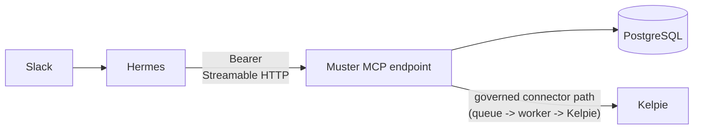

# Connecting Hermes to the remote Muster MCP endpoint

Muster exposes a remote [Streamable HTTP](https://modelcontextprotocol.io)
MCP endpoint at `apps/mcp-server`. It is the only way Hermes reaches Muster
in this slice: there is no chat UI, no Slack gateway, and no general
administration surface to connect to instead.



## What Muster stores, what Hermes never sees

- Muster stores one row per installation credential (`mcp_installations`):
  hashed token, the organisation it is bound to, the actor whose
  capabilities govern it, and its tool scopes. The plaintext token is shown
  once at creation time and is not recoverable.
- Muster stores Kelpie connector credentials encrypted at rest and never
  returns them, or any header/field matching a secret-shaped key, in a tool
  result. Kelpie itself remains authoritative for case content.
- Hermes never supplies an organisation id, actor id, or capability in a
  tool call. Those fields do not exist in any of the four tool schemas; the
  installation token is the only source of tenant identity, resolved
  server-side on every request.

## Provisioning an installation credential

There is no chat- or UI-driven registration flow — an operator provisions a
credential directly against Muster's database:

```bash
pnpm --filter @muster/mcp create-installation \
  --org=<organisationId> \
  --actor=<boundActorId> \
  --name="Hermes production"
```

This prints the installation id and the plaintext token once. Store the
token in Hermes's secret storage immediately; Muster only ever stores its
SHA-256 hash afterward.

To revoke a credential (immediate, fail-closed on the next call):

```bash
pnpm --filter @muster/mcp revoke-installation \
  --org=<organisationId> \
  --installation=<installationId> \
  --actor=<revokingActorId>
```

## Configuring Hermes

Configure Hermes's MCP client with the endpoint URL and the installation
token as a bearer credential. Placeholders only — never commit a real token:

```json
{
  "mcpServers": {
    "muster": {
      "url": "https://<your-muster-host>/mcp",
      "transport": "streamable-http",
      "headers": {
        "authorization": "Bearer <installation-token-placeholder>"
      }
    }
  }
}
```

`GET /health` on the same host is unauthenticated and reports readiness only
(no tenant data).

## Tools

- `muster_get_status` — organisation-scoped Muster and Kelpie connector
  status.
- `muster_list_capabilities` — capabilities and tools authorised for this
  installation.
- `muster_search_kelpie_cases` — bounded, classified Kelpie case search
  through the governed connector path.
- `muster_get_kelpie_case` — one Kelpie case by id, same bounding and
  classification.

All four are read-only. There is no write, destructive, or
external-communication tool in this slice; see
[skills/muster-soc-operations/SKILL.md](../../skills/muster-soc-operations/SKILL.md)
for the Hermes-side usage contract, evidence handling rules, and refusal
boundaries.

## Failure modes

Missing, malformed, revoked, and cross-organisation credentials all fail
the same way: an unauthenticated `401` that never reveals which case
applied. Kelpie query results are bounded (25 records) and truncation is
reported in the response rather than silently dropped.

Connector rule: Muster stores installation credentials, invocation/audit
records, and bounded Kelpie query results. Kelpie remains authoritative for
case lifecycle, evidence, and closure, exactly as described in
[current-upstream-contracts.md](current-upstream-contracts.md).
